<div align="center">

<!-- ===== HERO BANNER (dark monochrome — see hero-banner.svg, commit it to your repo root) ===== -->


<!-- ===== DYNAMIC TIME-BASED GREETING + TYPING INTRO ===== -->


<br/>

<!-- ===== LIVE COUNTERS ===== -->


</div>

<br/>

---

## 👨‍💻 `~/about-me` — Terminal



```javascript
const aboutMe = {
  name: "Rudra Tiwari",
  role: "Full Stack Developer",
  college: "Lovely Professional University",
  location: "India",
  code: ["Java", "JavaScript", "C++", "Python"],
  interests: [
    "Web Development",
    "DSA",
    "Open Source",
    "Backend Development"
  ],
  currentlyLearning: "System Design",
  funFact: "I turn coffee into code ☕"
};

// Always building. Always learning.
```

<br clear="right"/>

---

## ⚡ Tech Stack

<div align="center">

**Frontend**
<br/>


<br/>

**Backend & Database**
<br/>


<br/>

**Languages**
<br/>


<br/>

**Tools**
<br/>


</div>

<br/>

---

## 📊 Live GitHub Stats

<div align="center">


<br/>


</div>

<br/>

## 🌐 Contribution Activity

<div align="center">


<br/><br/>

<!-- Auto-updated by .github/workflows/profile-3d-contrib.yml — do not edit by hand -->


</div>

<br/>

---

## 🚀 Currently Building

<div align="center">

| Focus Area | Status |
|---|---|
| Solving DSA Problems | `In Progress` |
| Building Full Stack Projects | `In Progress` |
| Learning System Design | `In Progress` |
| Exploring Cloud Technologies | `Exploring` |

</div>

<br/>

---

## 🌟 Featured Projects

<div align="center">

<!-- These use your real repo name. Duplicate the <a></a> block and swap
     repo=YOUR_REPO_NAME for any other repos you want to feature. The repo
     must be public and must exactly match its name on GitHub (case-sensitive). -->
<a href="https://github.com/Rudra152005/DSA-Prep">
  
</a>

</div>

<br/>

---

## 🏆 Achievements

<div align="center">


</div>

<br/>

---

## ⏱️ Coding Activity

<div align="center">

<!-- WakaTime: connect your account at wakatime.com, then add the
     anmol098/waka-readme-stats GitHub Action — it will auto-write
     your weekly stats into the block below. -->
<!--START_SECTION:waka-->
```text
From: Connect WakaTime + waka-readme-stats Action to populate this automatically
```
<!--END_SECTION:waka-->

<br/>

**Recent GitHub Activity**

<!--START_SECTION:activity-->
<!-- Populated automatically by jamesgeorge007/github-activity-readme Action -->
<!--END_SECTION:activity-->

</div>

<br/>

---

## 🧩 LeetCode Stats

<div align="center">


[](https://leetcode.com/u/RudraTiwari/)

</div>

<br/>

---

## 📈 Open Source Journey

<div align="center">

```text
2024 ─▶ Started Coding
2025 ─▶ Web Development
2026 ─▶ Full Stack Projects
2027 ─▶ Open Source Contributions
```

</div>

<br/>

---

## 🔗 Connect With Me

<div align="center">

[](https://github.com/Rudra152005)
[](https://www.linkedin.com/in/rudra-tiwari05/)
[](https://x.com/tiwar95562)
[](https://github.com/Rudra152005)
[](mailto:rudra.tiwari@example.com)

</div>

<br/>

---

<div align="center">


<sub>⚙️ Stats auto-refresh via GitHub Actions &amp; live APIs — generated and maintained automatically</sub>


</div>
